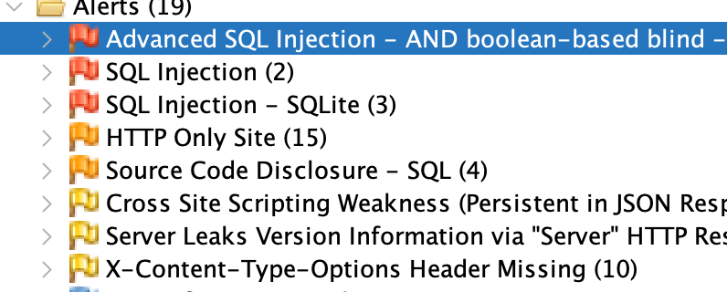
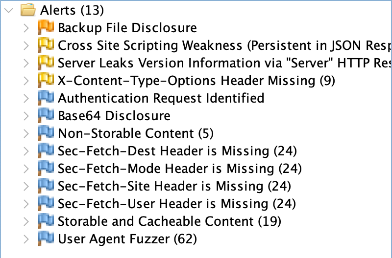
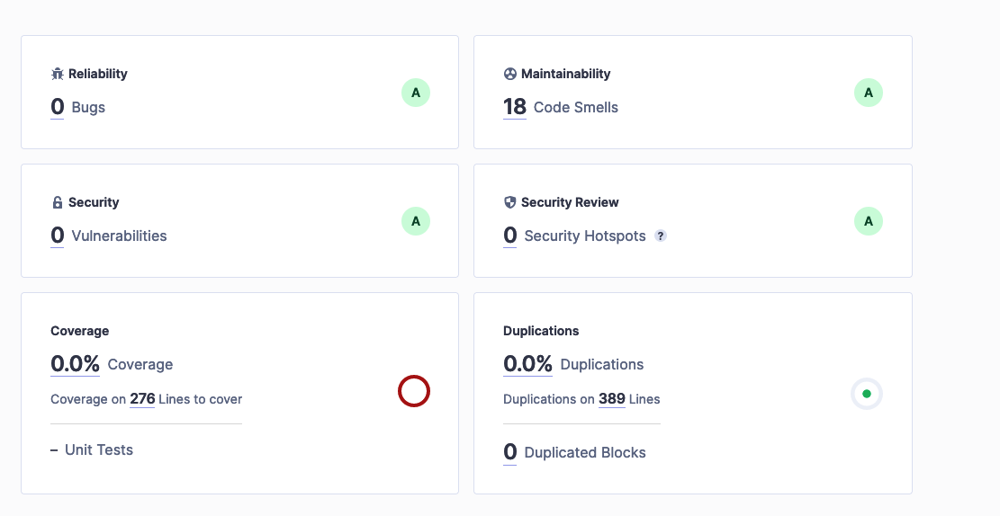

# Secure coding

## Module 1

Three vulnerbilities I would point out I discovered



- SQL injection
Using payload  John.Doe) AND 3059=3059 AND (8996=8996 we are able to preform SQL Injection to manipulate logic and preform operations on database
Code like this below

```python
    @staticmethod
    def get_user(username):
        user_query = f"SELECT * FROM users WHERE username = '{username}'"
        query = db.session.execute(text(user_query))
```

Allows the attacker to directly execute commands in the database. We do not sanitize the input here, as we should. Fixing this requires us to check the information being sent from the client and sanitize it properly.

--FIX--

By utilizing SQLAlchemy ORM, our input that is sent via request is sanitized, eliminating the danger of someone executing some unwanted code on our database. We also sanitize the input to be extra sure no SQL injection attack can be preformned

- Server Leaks Version Information via "Server" HTTP Response Header Field
The web/application server is leaking version information via the “Server” HTTP response header. Access to such information may facilitate attackers identifying other vulnerabilities your web/application server is subject to.

--FIX--

We can tackle this by changing the `Server` header to obscure what server version we are using

```python
def remove_server_header(app):
    @app.after_request
    def apply_custom_headers(response):
        response.headers.pop("Server", None)
        return response
```

- HTTP Only Site

Site is served only through localhost and through HTTP, we should enable encryption and provide a HTTPS certificate (for example, use Let's encrypt certificates through Certbot or similar)



## Module 2

Using SonarQube we revealed a few possible issues

- Possible DOS attack through usage of regex

Using `r"^([0-9a-zA-Z]([-.\w]*[0-9a-zA-Z])*@{1}([0-9a-zA-Z][-\w]*[0-9a-zA-Z]\.)+[a-zA-Z]{2,9})$",` leaves the possibity of being abused for a DoS attach through exponential runtime
Replacing it with `'^[a-z0-9]+[\._]?[a-z0-9]+[@]\w+[.]\w{2,3}$'` should eliminate the issue
- Possible unsecure random number generator
Using `randomint = str(randrange(100))`could be insecure, so we are going to enhance it by using cryptographically secure random number generator `randomint = str(secrets.randbelow(1000))`

- Python image runs as root user, possibly exposing vulnerabilities through it. We need to create a new user to not run commands as root.  
```dockerfile
RUN addgroup -S appgroup && adduser -S appuser -G appgroup
...
USER appuser
```

End result:



## Module 3

Simple JWT implementation with Access and Refresh token

```python
def token_validator(auth_header):
    if auth_header:
        try:
            auth_token = auth_header.split(" ")[1]
        except:
            auth_token = ""
    else:
        auth_token = ""
    if auth_token:
        # if auth_token is valid we get back the username of the user
        return User.decode_auth_token(auth_token)
    else:
        return "Invalid token"
        
```

```python
    @staticmethod
    def decode_auth_token(auth_token):
        try:
            payload = jwt.decode(auth_token, vuln_app.app.config.get('SECRET_KEY'), algorithms=["HS256"])
            return payload['sub']
        except jwt.ExpiredSignatureError:
            return jwt.ExpiredSignatureError
        except jwt.InvalidTokenError:
            return 'Invalid token. Please log in again.'
        
    @staticmethod    
    def decode_refresh_token(refresh_token):
        try:
            info = jwt.decode(refresh_token, vuln_app.app.config.get('SECRET_KEY'), algorithms=["HS256"])
            payload = {
                'exp': datetime.datetime.utcnow() + datetime.timedelta(days=0, seconds=alive),
                'iat': datetime.datetime.utcnow(),
                'sub': info['sub'],
                'type': 'access'
            }
            return jwt.encode(
                payload,
                vuln_app.app.config.get('SECRET_KEY'),
                algorithm='HS256'
            )

        except jwt.ExpiredSignatureError:
            return jwt.ExpiredSignatureError
        except jwt.InvalidTokenError:
            return 'Invalid token. Please log in again.'
```

```python
def refresh_access_token(refresh_token):
    if refresh_token:
        try:
            refresh_token = refresh_token.split(" ")[1]
        except:
            refresh_token = ""
    else:
        refresh_token = ""
    if refresh_token:
        return User.decode_refresh_token(refresh_token)
    else:
        return "Invalid token"
```

API has a login route that users login with login and password. After successfully logging in, refresh and access token are returned from the API. Given those tokens, user can now access resources locked behind authorizaton. JWT access tokens are short lived and used to access data. Refresh tokens are used to refresh the access token and to regain access to data. When both expire, user is logged out and he has to login again.

## Module 4

I've used sqlmap as a tool to locally test out SQL injection attacks

```bash
[14:45:25] mislavperi@C02D8111MD6W /Users/mislavperi/Downloads/sqlmapproject-sqlmap-ae1bd21
> python3 sqlmap.py -u "http://localhost:5000/users/v1/login" --method POST --headers="Content-Type: application/json" --data='{"username": "*", "password": "test"}' -p username --risk 3 --level 5
        ___
       __H__
 ___ ___[(]_____ ___ ___  {1.8.2#stable}
|_ -| . [,]     | .'| . |
|___|_  ["]_|_|_|__,|  _|
      |_|V...       |_|   https://sqlmap.org

[!] legal disclaimer: Usage of sqlmap for attacking targets without prior mutual consent is illegal. It is the end user's responsibility to obey all applicable local, state and federal laws. Developers assume no liability and are not responsible for any misuse or damage caused by this program

[*] starting @ 14:46:25 

custom injection marker ('*') found in POST body. Do you want to process it? [Y/n/q]

JSON data found in POST body. Do you want to process it? [Y/n/q]

[14:46:26] [INFO] testing connection to the target URL
[14:46:26] [INFO] testing if the target URL content is stable

[14:46:26] [INFO] target URL content is stable
[14:46:26] [INFO] testing if (custom) POST parameter 'JSON #1*' is dynamic
[14:46:26] [WARNING] (custom) POST parameter 'JSON #1*' does not appear to be dynamic
[14:46:26] [WARNING] heuristic (basic) test shows that (custom) POST parameter 'JSON #1*' might not be injectable
[14:46:26] [INFO] testing for SQL injection on (custom) POST parameter 'JSON #1*'
[14:46:26] [INFO] testing 'AND boolean-based blind - WHERE or HAVING clause'
[14:46:27] [INFO] testing 'OR boolean-based blind - WHERE or HAVING clause'
[14:46:27] [INFO] testing 'OR boolean-based blind - WHERE or HAVING clause (NOT)'
[14:46:27] [INFO] testing 'AND boolean-based blind - WHERE or HAVING clause (subquery - comment)'
[14:46:28] [INFO] testing 'OR boolean-based blind - WHERE or HAVING clause (subquery - comment)'
[14:46:28] [INFO] testing 'AND boolean-based blind - WHERE or HAVING clause (comment)'
[14:46:28] [INFO] testing 'OR boolean-based blind - WHERE or HAVING clause (comment)'
[14:46:28] [INFO] testing 'OR boolean-based blind - WHERE or HAVING clause (NOT - comment)'
[14:46:28] [INFO] testing 'AND boolean-based blind - WHERE or HAVING clause (MySQL comment)'
[14:46:28] [INFO] testing 'OR boolean-based blind - WHERE or HAVING clause (MySQL comment)'
[14:46:29] [INFO] testing 'OR boolean-based blind - WHERE or HAVING clause (NOT - MySQL comment)'
[14:46:29] [INFO] testing 'AND boolean-based blind - WHERE or HAVING clause (Microsoft Access comment)'
[14:46:29] [INFO] testing 'OR boolean-based blind - WHERE or HAVING clause (Microsoft Access comment)'
[14:46:29] [INFO] testing 'MySQL RLIKE boolean-based blind - WHERE, HAVING, ORDER BY or GROUP BY clause'
[14:46:29] [INFO] testing 'MySQL AND boolean-based blind - WHERE, HAVING, ORDER BY or GROUP BY clause (MAKE_SET)'
[14:46:30] [INFO] testing 'MySQL OR boolean-based blind - WHERE, HAVING, ORDER BY or GROUP BY clause (MAKE_SET)'
[14:46:30] [INFO] testing 'MySQL AND boolean-based blind - WHERE, HAVING, ORDER BY or GROUP BY clause (ELT)'
[14:46:30] [INFO] testing 'MySQL OR boolean-based blind - WHERE, HAVING, ORDER BY or GROUP BY clause (ELT)'
[14:46:31] [INFO] testing 'MySQL AND boolean-based blind - WHERE, HAVING, ORDER BY or GROUP BY clause (EXTRACTVALUE)'
[14:46:31] [INFO] testing 'MySQL OR boolean-based blind - WHERE, HAVING, ORDER BY or GROUP BY clause (EXTRACTVALUE)'
[14:46:31] [INFO] testing 'PostgreSQL AND boolean-based blind - WHERE or HAVING clause (CAST)'
[14:46:31] [INFO] testing 'PostgreSQL OR boolean-based blind - WHERE or HAVING clause (CAST)'
[14:46:32] [INFO] testing 'Oracle AND boolean-based blind - WHERE or HAVING clause (CTXSYS.DRITHSX.SN)'
[14:46:32] [INFO] testing 'Oracle OR boolean-based blind - WHERE or HAVING clause (CTXSYS.DRITHSX.SN)'
[14:46:33] [INFO] testing 'SQLite AND boolean-based blind - WHERE, HAVING, GROUP BY or HAVING clause (JSON)'
[14:46:33] [INFO] testing 'SQLite OR boolean-based blind - WHERE, HAVING, GROUP BY or HAVING clause (JSON)'
[14:46:33] [INFO] testing 'Boolean-based blind - Parameter replace (original value)'
[14:46:33] [INFO] testing 'MySQL boolean-based blind - Parameter replace (MAKE_SET)'
[14:46:33] [INFO] testing 'MySQL boolean-based blind - Parameter replace (MAKE_SET - original value)'
[14:46:33] [INFO] testing 'MySQL boolean-based blind - Parameter replace (ELT)'
[14:46:33] [INFO] testing 'MySQL boolean-based blind - Parameter replace (ELT - original value)'
[14:46:33] [INFO] testing 'MySQL boolean-based blind - Parameter replace (bool*int)'
[14:46:33] [INFO] testing 'MySQL boolean-based blind - Parameter replace (bool*int - original value)'
[14:46:33] [INFO] testing 'PostgreSQL boolean-based blind - Parameter replace'
[14:46:33] [INFO] testing 'PostgreSQL boolean-based blind - Parameter replace (original value)'
[14:46:33] [INFO] testing 'PostgreSQL boolean-based blind - Parameter replace (GENERATE_SERIES)'
[14:46:33] [INFO] testing 'PostgreSQL boolean-based blind - Parameter replace (GENERATE_SERIES - original value)'
[14:46:33] [INFO] testing 'Microsoft SQL Server/Sybase boolean-based blind - Parameter replace'
[14:46:33] [INFO] testing 'Microsoft SQL Server/Sybase boolean-based blind - Parameter replace (original value)'
[14:46:33] [INFO] testing 'Oracle boolean-based blind - Parameter replace'
[14:46:33] [INFO] testing 'Oracle boolean-based blind - Parameter replace (original value)'
[14:46:33] [INFO] testing 'Informix boolean-based blind - Parameter replace'
[14:46:33] [INFO] testing 'Informix boolean-based blind - Parameter replace (original value)'
[14:46:33] [INFO] testing 'Microsoft Access boolean-based blind - Parameter replace'
[14:46:33] [INFO] testing 'Microsoft Access boolean-based blind - Parameter replace (original value)'
[14:46:33] [INFO] testing 'Boolean-based blind - Parameter replace (DUAL)'
[14:46:33] [INFO] testing 'Boolean-based blind - Parameter replace (DUAL - original value)'
[14:46:33] [INFO] testing 'Boolean-based blind - Parameter replace (CASE)'
[14:46:33] [INFO] testing 'Boolean-based blind - Parameter replace (CASE - original value)'
[14:46:33] [INFO] testing 'MySQL >= 5.0 boolean-based blind - ORDER BY, GROUP BY clause'
[14:46:33] [INFO] testing 'MySQL >= 5.0 boolean-based blind - ORDER BY, GROUP BY clause (original value)'
[14:46:33] [INFO] testing 'MySQL < 5.0 boolean-based blind - ORDER BY, GROUP BY clause'
[14:46:33] [INFO] testing 'MySQL < 5.0 boolean-based blind - ORDER BY, GROUP BY clause (original value)'
[14:46:33] [INFO] testing 'PostgreSQL boolean-based blind - ORDER BY, GROUP BY clause'
[14:46:33] [INFO] testing 'PostgreSQL boolean-based blind - ORDER BY clause (original value)'
[14:46:33] [INFO] testing 'PostgreSQL boolean-based blind - ORDER BY clause (GENERATE_SERIES)'
[14:46:33] [INFO] testing 'Microsoft SQL Server/Sybase boolean-based blind - ORDER BY clause'
[14:46:33] [INFO] testing 'Microsoft SQL Server/Sybase boolean-based blind - ORDER BY clause (original value)'
[14:46:33] [INFO] testing 'Oracle boolean-based blind - ORDER BY, GROUP BY clause'
[14:46:33] [INFO] testing 'Oracle boolean-based blind - ORDER BY, GROUP BY clause (original value)'
[14:46:33] [INFO] testing 'Microsoft Access boolean-based blind - ORDER BY, GROUP BY clause'
[14:46:33] [INFO] testing 'Microsoft Access boolean-based blind - ORDER BY, GROUP BY clause (original value)'
[14:46:33] [INFO] testing 'SAP MaxDB boolean-based blind - ORDER BY, GROUP BY clause'
[14:46:33] [INFO] testing 'SAP MaxDB boolean-based blind - ORDER BY, GROUP BY clause (original value)'
[14:46:34] [INFO] testing 'IBM DB2 boolean-based blind - ORDER BY clause'
[14:46:34] [INFO] testing 'IBM DB2 boolean-based blind - ORDER BY clause (original value)'
[14:46:34] [INFO] testing 'HAVING boolean-based blind - WHERE, GROUP BY clause'
[14:46:34] [INFO] testing 'MySQL >= 5.0 boolean-based blind - Stacked queries'
[14:46:34] [INFO] testing 'MySQL < 5.0 boolean-based blind - Stacked queries'
[14:46:34] [INFO] testing 'PostgreSQL boolean-based blind - Stacked queries'
[14:46:34] [INFO] testing 'PostgreSQL boolean-based blind - Stacked queries (GENERATE_SERIES)'
[14:46:34] [INFO] testing 'Microsoft SQL Server/Sybase boolean-based blind - Stacked queries (IF)'
[14:46:34] [INFO] testing 'Microsoft SQL Server/Sybase boolean-based blind - Stacked queries'
[14:46:35] [INFO] testing 'Oracle boolean-based blind - Stacked queries'
[14:46:35] [INFO] testing 'Microsoft Access boolean-based blind - Stacked queries'
[14:46:35] [INFO] testing 'SAP MaxDB boolean-based blind - Stacked queries'
[14:46:35] [INFO] testing 'MySQL >= 5.5 AND error-based - WHERE, HAVING, ORDER BY or GROUP BY clause (BIGINT UNSIGNED)'
[14:46:35] [INFO] testing 'MySQL >= 5.5 OR error-based - WHERE or HAVING clause (BIGINT UNSIGNED)'
[14:46:36] [INFO] testing 'MySQL >= 5.5 AND error-based - WHERE, HAVING, ORDER BY or GROUP BY clause (EXP)'
[14:46:36] [INFO] testing 'MySQL >= 5.5 OR error-based - WHERE or HAVING clause (EXP)'
[14:46:36] [INFO] testing 'MySQL >= 5.6 AND error-based - WHERE, HAVING, ORDER BY or GROUP BY clause (GTID_SUBSET)'
[14:46:37] [INFO] testing 'MySQL >= 5.6 OR error-based - WHERE or HAVING clause (GTID_SUBSET)'
[14:46:37] [INFO] testing 'MySQL >= 5.7.8 AND error-based - WHERE, HAVING, ORDER BY or GROUP BY clause (JSON_KEYS)'
[14:46:37] [INFO] testing 'MySQL >= 5.7.8 OR error-based - WHERE or HAVING clause (JSON_KEYS)'
[14:46:38] [INFO] testing 'MySQL >= 5.0 AND error-based - WHERE, HAVING, ORDER BY or GROUP BY clause (FLOOR)'
[14:46:38] [INFO] testing 'MySQL >= 5.0 OR error-based - WHERE, HAVING, ORDER BY or GROUP BY clause (FLOOR)'
[14:46:38] [INFO] testing 'MySQL >= 5.1 AND error-based - WHERE, HAVING, ORDER BY or GROUP BY clause (EXTRACTVALUE)'
[14:46:39] [INFO] testing 'MySQL >= 5.1 OR error-based - WHERE, HAVING, ORDER BY or GROUP BY clause (EXTRACTVALUE)'
[14:46:39] [INFO] testing 'MySQL >= 5.1 AND error-based - WHERE, HAVING, ORDER BY or GROUP BY clause (UPDATEXML)'
[14:46:39] [INFO] testing 'MySQL >= 5.1 OR error-based - WHERE, HAVING, ORDER BY or GROUP BY clause (UPDATEXML)'
[14:46:39] [INFO] testing 'MySQL >= 4.1 AND error-based - WHERE, HAVING, ORDER BY or GROUP BY clause (FLOOR)'
[14:46:40] [INFO] testing 'MySQL >= 4.1 OR error-based - WHERE or HAVING clause (FLOOR)'
[14:46:40] [INFO] testing 'MySQL OR error-based - WHERE or HAVING clause (FLOOR)'
[14:46:40] [INFO] testing 'PostgreSQL AND error-based - WHERE or HAVING clause'
[14:46:41] [INFO] testing 'PostgreSQL OR error-based - WHERE or HAVING clause'
[14:46:41] [INFO] testing 'Microsoft SQL Server/Sybase AND error-based - WHERE or HAVING clause (IN)'
[14:46:41] [INFO] testing 'Microsoft SQL Server/Sybase OR error-based - WHERE or HAVING clause (IN)'
[14:46:41] [INFO] testing 'Microsoft SQL Server/Sybase AND error-based - WHERE or HAVING clause (CONVERT)'
[14:46:42] [INFO] testing 'Microsoft SQL Server/Sybase OR error-based - WHERE or HAVING clause (CONVERT)'
[14:46:42] [INFO] testing 'Microsoft SQL Server/Sybase AND error-based - WHERE or HAVING clause (CONCAT)'
[14:46:42] [INFO] testing 'Microsoft SQL Server/Sybase OR error-based - WHERE or HAVING clause (CONCAT)'
[14:46:43] [INFO] testing 'Oracle AND error-based - WHERE or HAVING clause (XMLType)'
[14:46:43] [INFO] testing 'Oracle OR error-based - WHERE or HAVING clause (XMLType)'
[14:46:43] [INFO] testing 'Oracle AND error-based - WHERE or HAVING clause (UTL_INADDR.GET_HOST_ADDRESS)'
[14:46:43] [INFO] testing 'Oracle OR error-based - WHERE or HAVING clause (UTL_INADDR.GET_HOST_ADDRESS)'
[14:46:44] [INFO] testing 'Oracle AND error-based - WHERE or HAVING clause (CTXSYS.DRITHSX.SN)'
[14:46:44] [INFO] testing 'Oracle OR error-based - WHERE or HAVING clause (CTXSYS.DRITHSX.SN)'
[14:46:44] [INFO] testing 'Oracle AND error-based - WHERE or HAVING clause (DBMS_UTILITY.SQLID_TO_SQLHASH)'
[14:46:44] [INFO] testing 'Oracle OR error-based - WHERE or HAVING clause (DBMS_UTILITY.SQLID_TO_SQLHASH)'
[14:46:45] [INFO] testing 'Firebird AND error-based - WHERE or HAVING clause'
[14:46:45] [INFO] testing 'Firebird OR error-based - WHERE or HAVING clause'
[14:46:45] [INFO] testing 'MonetDB AND error-based - WHERE or HAVING clause'
[14:46:45] [INFO] testing 'MonetDB OR error-based - WHERE or HAVING clause'
[14:46:46] [INFO] testing 'Vertica AND error-based - WHERE or HAVING clause'
[14:46:46] [INFO] testing 'Vertica OR error-based - WHERE or HAVING clause'
[14:46:46] [INFO] testing 'IBM DB2 AND error-based - WHERE or HAVING clause'
[14:46:46] [INFO] testing 'IBM DB2 OR error-based - WHERE or HAVING clause'
[14:46:47] [INFO] testing 'ClickHouse AND error-based - WHERE, HAVING, ORDER BY or GROUP BY clause'
[14:46:47] [INFO] testing 'ClickHouse OR error-based - WHERE, HAVING, ORDER BY or GROUP BY clause'
[14:46:47] [INFO] testing 'MySQL >= 5.1 error-based - PROCEDURE ANALYSE (EXTRACTVALUE)'
[14:46:47] [INFO] testing 'MySQL >= 5.5 error-based - Parameter replace (BIGINT UNSIGNED)'
[14:46:47] [INFO] testing 'MySQL >= 5.5 error-based - Parameter replace (EXP)'
[14:46:47] [INFO] testing 'MySQL >= 5.6 error-based - Parameter replace (GTID_SUBSET)'
[14:46:47] [INFO] testing 'MySQL >= 5.7.8 error-based - Parameter replace (JSON_KEYS)'
[14:46:47] [INFO] testing 'MySQL >= 5.0 error-based - Parameter replace (FLOOR)'
[14:46:47] [INFO] testing 'MySQL >= 5.1 error-based - Parameter replace (UPDATEXML)'
[14:46:47] [INFO] testing 'MySQL >= 5.1 error-based - Parameter replace (EXTRACTVALUE)'
[14:46:47] [INFO] testing 'PostgreSQL error-based - Parameter replace'
[14:46:47] [INFO] testing 'PostgreSQL error-based - Parameter replace (GENERATE_SERIES)'
[14:46:47] [INFO] testing 'Microsoft SQL Server/Sybase error-based - Parameter replace'
[14:46:47] [INFO] testing 'Microsoft SQL Server/Sybase error-based - Parameter replace (integer column)'
[14:46:47] [INFO] testing 'Oracle error-based - Parameter replace'
[14:46:47] [INFO] testing 'Firebird error-based - Parameter replace'
[14:46:47] [INFO] testing 'IBM DB2 error-based - Parameter replace'
[14:46:47] [INFO] testing 'MySQL >= 5.5 error-based - ORDER BY, GROUP BY clause (BIGINT UNSIGNED)'
[14:46:47] [INFO] testing 'MySQL >= 5.5 error-based - ORDER BY, GROUP BY clause (EXP)'
[14:46:48] [INFO] testing 'MySQL >= 5.6 error-based - ORDER BY, GROUP BY clause (GTID_SUBSET)'
[14:46:48] [INFO] testing 'MySQL >= 5.7.8 error-based - ORDER BY, GROUP BY clause (JSON_KEYS)'
[14:46:48] [INFO] testing 'MySQL >= 5.0 error-based - ORDER BY, GROUP BY clause (FLOOR)'
[14:46:48] [INFO] testing 'MySQL >= 5.1 error-based - ORDER BY, GROUP BY clause (EXTRACTVALUE)'
[14:46:48] [INFO] testing 'MySQL >= 5.1 error-based - ORDER BY, GROUP BY clause (UPDATEXML)'
[14:46:48] [INFO] testing 'MySQL >= 4.1 error-based - ORDER BY, GROUP BY clause (FLOOR)'
[14:46:48] [INFO] testing 'PostgreSQL error-based - ORDER BY, GROUP BY clause'
[14:46:48] [INFO] testing 'PostgreSQL error-based - ORDER BY, GROUP BY clause (GENERATE_SERIES)'
[14:46:48] [INFO] testing 'Microsoft SQL Server/Sybase error-based - ORDER BY clause'
[14:46:48] [INFO] testing 'Oracle error-based - ORDER BY, GROUP BY clause'
[14:46:48] [INFO] testing 'Firebird error-based - ORDER BY clause'
[14:46:48] [INFO] testing 'IBM DB2 error-based - ORDER BY clause'
[14:46:48] [INFO] testing 'Microsoft SQL Server/Sybase error-based - Stacking (EXEC)'
[14:46:48] [INFO] testing 'Generic inline queries'
[14:46:48] [INFO] testing 'MySQL inline queries'
[14:46:48] [INFO] testing 'PostgreSQL inline queries'
[14:46:48] [INFO] testing 'Microsoft SQL Server/Sybase inline queries'
[14:46:48] [INFO] testing 'Oracle inline queries'
[14:46:48] [INFO] testing 'SQLite inline queries'
[14:46:48] [INFO] testing 'Firebird inline queries'
[14:46:48] [INFO] testing 'ClickHouse inline queries'
[14:46:48] [INFO] testing 'MySQL >= 5.0.12 stacked queries (comment)'
[14:46:48] [INFO] testing 'MySQL >= 5.0.12 stacked queries'
[14:46:48] [INFO] testing 'MySQL >= 5.0.12 stacked queries (query SLEEP - comment)'
[14:46:48] [INFO] testing 'MySQL >= 5.0.12 stacked queries (query SLEEP)'
[14:46:49] [INFO] testing 'MySQL < 5.0.12 stacked queries (BENCHMARK - comment)'
[14:46:49] [INFO] testing 'MySQL < 5.0.12 stacked queries (BENCHMARK)'
[14:46:49] [INFO] testing 'PostgreSQL > 8.1 stacked queries (comment)'
[14:46:49] [INFO] testing 'PostgreSQL > 8.1 stacked queries'
[14:46:49] [INFO] testing 'PostgreSQL stacked queries (heavy query - comment)'
[14:46:50] [INFO] testing 'PostgreSQL stacked queries (heavy query)'
[14:46:50] [INFO] testing 'PostgreSQL < 8.2 stacked queries (Glibc - comment)'
[14:46:50] [INFO] testing 'PostgreSQL < 8.2 stacked queries (Glibc)'
[14:46:50] [INFO] testing 'Microsoft SQL Server/Sybase stacked queries (comment)'
[14:46:50] [INFO] testing 'Microsoft SQL Server/Sybase stacked queries (DECLARE - comment)'
[14:46:50] [INFO] testing 'Microsoft SQL Server/Sybase stacked queries'
[14:46:51] [INFO] testing 'Microsoft SQL Server/Sybase stacked queries (DECLARE)'
[14:46:51] [INFO] testing 'Oracle stacked queries (DBMS_PIPE.RECEIVE_MESSAGE - comment)'
[14:46:51] [INFO] testing 'Oracle stacked queries (DBMS_PIPE.RECEIVE_MESSAGE)'
[14:46:51] [INFO] testing 'Oracle stacked queries (heavy query - comment)'
[14:46:52] [INFO] testing 'Oracle stacked queries (heavy query)'
[14:46:52] [INFO] testing 'Oracle stacked queries (DBMS_LOCK.SLEEP - comment)'
[14:46:52] [INFO] testing 'Oracle stacked queries (DBMS_LOCK.SLEEP)'
[14:46:52] [INFO] testing 'Oracle stacked queries (USER_LOCK.SLEEP - comment)'
[14:46:52] [INFO] testing 'Oracle stacked queries (USER_LOCK.SLEEP)'
[14:46:52] [INFO] testing 'IBM DB2 stacked queries (heavy query - comment)'
[14:46:52] [INFO] testing 'IBM DB2 stacked queries (heavy query)'
[14:46:53] [INFO] testing 'SQLite > 2.0 stacked queries (heavy query - comment)'
[14:46:53] [INFO] testing 'SQLite > 2.0 stacked queries (heavy query)'
[14:46:53] [INFO] testing 'Firebird stacked queries (heavy query - comment)'
[14:46:53] [INFO] testing 'Firebird stacked queries (heavy query)'
[14:46:53] [INFO] testing 'SAP MaxDB stacked queries (heavy query - comment)'
[14:46:54] [INFO] testing 'SAP MaxDB stacked queries (heavy query)'
[14:46:54] [INFO] testing 'HSQLDB >= 1.7.2 stacked queries (heavy query - comment)'
[14:46:54] [INFO] testing 'HSQLDB >= 1.7.2 stacked queries (heavy query)'
[14:46:54] [INFO] testing 'HSQLDB >= 2.0 stacked queries (heavy query - comment)'
[14:46:54] [INFO] testing 'HSQLDB >= 2.0 stacked queries (heavy query)'
[14:46:55] [INFO] testing 'MySQL >= 5.0.12 AND time-based blind (query SLEEP)'
[14:46:55] [INFO] testing 'MySQL >= 5.0.12 OR time-based blind (query SLEEP)'
[14:46:55] [INFO] testing 'MySQL >= 5.0.12 AND time-based blind (SLEEP)'
[14:46:55] [INFO] testing 'MySQL >= 5.0.12 OR time-based blind (SLEEP)'
[14:46:56] [INFO] testing 'MySQL >= 5.0.12 AND time-based blind (SLEEP - comment)'
[14:46:56] [INFO] testing 'MySQL >= 5.0.12 OR time-based blind (SLEEP - comment)'
[14:46:56] [INFO] testing 'MySQL >= 5.0.12 AND time-based blind (query SLEEP - comment)'
[14:46:56] [INFO] testing 'MySQL >= 5.0.12 OR time-based blind (query SLEEP - comment)'
[14:46:57] [INFO] testing 'MySQL < 5.0.12 AND time-based blind (BENCHMARK)'
[14:46:57] [INFO] testing 'MySQL > 5.0.12 AND time-based blind (heavy query)'
[14:46:57] [INFO] testing 'MySQL < 5.0.12 OR time-based blind (BENCHMARK)'
[14:46:57] [INFO] testing 'MySQL > 5.0.12 OR time-based blind (heavy query)'
[14:46:58] [INFO] testing 'MySQL < 5.0.12 AND time-based blind (BENCHMARK - comment)'
[14:46:58] [INFO] testing 'MySQL > 5.0.12 AND time-based blind (heavy query - comment)'
[14:46:58] [INFO] testing 'MySQL < 5.0.12 OR time-based blind (BENCHMARK - comment)'
[14:46:58] [INFO] testing 'MySQL > 5.0.12 OR time-based blind (heavy query - comment)'
[14:46:59] [INFO] testing 'MySQL >= 5.0.12 RLIKE time-based blind'
[14:46:59] [INFO] testing 'MySQL >= 5.0.12 RLIKE time-based blind (comment)'
[14:46:59] [INFO] testing 'MySQL >= 5.0.12 RLIKE time-based blind (query SLEEP)'
[14:46:59] [INFO] testing 'MySQL >= 5.0.12 RLIKE time-based blind (query SLEEP - comment)'
[14:46:59] [INFO] testing 'MySQL AND time-based blind (ELT)'
[14:47:00] [INFO] testing 'MySQL OR time-based blind (ELT)'
[14:47:00] [INFO] testing 'MySQL AND time-based blind (ELT - comment)'
[14:47:00] [INFO] testing 'MySQL OR time-based blind (ELT - comment)'
[14:47:01] [INFO] testing 'PostgreSQL > 8.1 AND time-based blind'
[14:47:01] [INFO] testing 'PostgreSQL > 8.1 OR time-based blind'
[14:47:01] [INFO] testing 'PostgreSQL > 8.1 AND time-based blind (comment)'
[14:47:01] [INFO] testing 'PostgreSQL > 8.1 OR time-based blind (comment)'
[14:47:02] [INFO] testing 'PostgreSQL AND time-based blind (heavy query)'
[14:47:02] [INFO] testing 'PostgreSQL OR time-based blind (heavy query)'
[14:47:02] [INFO] testing 'PostgreSQL AND time-based blind (heavy query - comment)'
[14:47:02] [INFO] testing 'PostgreSQL OR time-based blind (heavy query - comment)'
[14:47:03] [INFO] testing 'Microsoft SQL Server/Sybase time-based blind (IF)'
[14:47:03] [INFO] testing 'Microsoft SQL Server/Sybase time-based blind (IF - comment)'
[14:47:03] [INFO] testing 'Microsoft SQL Server/Sybase AND time-based blind (heavy query)'
[14:47:04] [INFO] testing 'Microsoft SQL Server/Sybase OR time-based blind (heavy query)'
[14:47:04] [INFO] testing 'Microsoft SQL Server/Sybase AND time-based blind (heavy query - comment)'
[14:47:04] [INFO] testing 'Microsoft SQL Server/Sybase OR time-based blind (heavy query - comment)'
[14:47:04] [INFO] testing 'Oracle AND time-based blind'
[14:47:05] [INFO] testing 'Oracle OR time-based blind'
[14:47:05] [INFO] testing 'Oracle AND time-based blind (comment)'
[14:47:05] [INFO] testing 'Oracle OR time-based blind (comment)'
[14:47:05] [INFO] testing 'Oracle AND time-based blind (heavy query)'
[14:47:06] [INFO] testing 'Oracle OR time-based blind (heavy query)'
[14:47:06] [INFO] testing 'Oracle AND time-based blind (heavy query - comment)'
[14:47:06] [INFO] testing 'Oracle OR time-based blind (heavy query - comment)'
[14:47:06] [INFO] testing 'IBM DB2 AND time-based blind (heavy query)'
[14:47:07] [INFO] testing 'IBM DB2 OR time-based blind (heavy query)'
[14:47:07] [INFO] testing 'IBM DB2 AND time-based blind (heavy query - comment)'
[14:47:07] [INFO] testing 'IBM DB2 OR time-based blind (heavy query - comment)'
[14:47:07] [INFO] testing 'SQLite > 2.0 AND time-based blind (heavy query)'
[14:47:08] [INFO] testing 'SQLite > 2.0 OR time-based blind (heavy query)'
[14:47:08] [INFO] testing 'SQLite > 2.0 AND time-based blind (heavy query - comment)'
[14:47:08] [INFO] testing 'SQLite > 2.0 OR time-based blind (heavy query - comment)'
[14:47:08] [INFO] testing 'Firebird >= 2.0 AND time-based blind (heavy query)'
[14:47:09] [INFO] testing 'Firebird >= 2.0 OR time-based blind (heavy query)'
[14:47:09] [INFO] testing 'Firebird >= 2.0 AND time-based blind (heavy query - comment)'
[14:47:09] [INFO] testing 'Firebird >= 2.0 OR time-based blind (heavy query - comment)'
[14:47:10] [INFO] testing 'SAP MaxDB AND time-based blind (heavy query)'
[14:47:10] [INFO] testing 'SAP MaxDB OR time-based blind (heavy query)'
[14:47:10] [INFO] testing 'SAP MaxDB AND time-based blind (heavy query - comment)'
[14:47:10] [INFO] testing 'SAP MaxDB OR time-based blind (heavy query - comment)'
[14:47:11] [INFO] testing 'HSQLDB >= 1.7.2 AND time-based blind (heavy query)'
[14:47:11] [INFO] testing 'HSQLDB >= 1.7.2 OR time-based blind (heavy query)'
[14:47:11] [INFO] testing 'HSQLDB >= 1.7.2 AND time-based blind (heavy query - comment)'
[14:47:11] [INFO] testing 'HSQLDB >= 1.7.2 OR time-based blind (heavy query - comment)'
[14:47:12] [INFO] testing 'HSQLDB > 2.0 AND time-based blind (heavy query)'
[14:47:12] [INFO] testing 'HSQLDB > 2.0 OR time-based blind (heavy query)'
[14:47:12] [INFO] testing 'HSQLDB > 2.0 AND time-based blind (heavy query - comment)'
[14:47:12] [INFO] testing 'HSQLDB > 2.0 OR time-based blind (heavy query - comment)'
[14:47:13] [INFO] testing 'Informix AND time-based blind (heavy query)'
[14:47:13] [INFO] testing 'Informix OR time-based blind (heavy query)'
[14:47:13] [INFO] testing 'Informix AND time-based blind (heavy query - comment)'
[14:47:13] [INFO] testing 'Informix OR time-based blind (heavy query - comment)'
[14:47:14] [INFO] testing 'ClickHouse AND time-based blind (heavy query)'
[14:47:14] [INFO] testing 'ClickHouse OR time-based blind (heavy query)'
[14:47:14] [INFO] testing 'MySQL >= 5.1 time-based blind (heavy query) - PROCEDURE ANALYSE (EXTRACTVALUE)'
[14:47:14] [INFO] testing 'MySQL >= 5.1 time-based blind (heavy query - comment) - PROCEDURE ANALYSE (EXTRACTVALUE)'
[14:47:15] [INFO] testing 'MySQL >= 5.0.12 time-based blind - Parameter replace'
[14:47:15] [INFO] testing 'MySQL >= 5.0.12 time-based blind - Parameter replace (substraction)'
[14:47:15] [INFO] testing 'MySQL < 5.0.12 time-based blind - Parameter replace (BENCHMARK)'
[14:47:15] [INFO] testing 'MySQL > 5.0.12 time-based blind - Parameter replace (heavy query - comment)'
[14:47:15] [INFO] testing 'MySQL time-based blind - Parameter replace (bool)'
[14:47:15] [INFO] testing 'MySQL time-based blind - Parameter replace (ELT)'
[14:47:15] [INFO] testing 'MySQL time-based blind - Parameter replace (MAKE_SET)'
[14:47:15] [INFO] testing 'PostgreSQL > 8.1 time-based blind - Parameter replace'
[14:47:15] [INFO] testing 'PostgreSQL time-based blind - Parameter replace (heavy query)'
[14:47:15] [INFO] testing 'Microsoft SQL Server/Sybase time-based blind - Parameter replace (heavy queries)'
[14:47:15] [INFO] testing 'Oracle time-based blind - Parameter replace (DBMS_LOCK.SLEEP)'
[14:47:15] [INFO] testing 'Oracle time-based blind - Parameter replace (DBMS_PIPE.RECEIVE_MESSAGE)'
[14:47:15] [INFO] testing 'Oracle time-based blind - Parameter replace (heavy queries)'
[14:47:15] [INFO] testing 'SQLite > 2.0 time-based blind - Parameter replace (heavy query)'
[14:47:15] [INFO] testing 'Firebird time-based blind - Parameter replace (heavy query)'
[14:47:15] [INFO] testing 'SAP MaxDB time-based blind - Parameter replace (heavy query)'
[14:47:15] [INFO] testing 'IBM DB2 time-based blind - Parameter replace (heavy query)'
[14:47:15] [INFO] testing 'HSQLDB >= 1.7.2 time-based blind - Parameter replace (heavy query)'
[14:47:15] [INFO] testing 'HSQLDB > 2.0 time-based blind - Parameter replace (heavy query)'
[14:47:15] [INFO] testing 'Informix time-based blind - Parameter replace (heavy query)'
[14:47:15] [INFO] testing 'MySQL >= 5.0.12 time-based blind - ORDER BY, GROUP BY clause'
[14:47:15] [INFO] testing 'MySQL < 5.0.12 time-based blind - ORDER BY, GROUP BY clause (BENCHMARK)'
[14:47:15] [INFO] testing 'PostgreSQL > 8.1 time-based blind - ORDER BY, GROUP BY clause'
[14:47:15] [INFO] testing 'PostgreSQL time-based blind - ORDER BY, GROUP BY clause (heavy query)'
[14:47:15] [INFO] testing 'Microsoft SQL Server/Sybase time-based blind - ORDER BY clause (heavy query)'
[14:47:15] [INFO] testing 'Oracle time-based blind - ORDER BY, GROUP BY clause (DBMS_LOCK.SLEEP)'
[14:47:15] [INFO] testing 'Oracle time-based blind - ORDER BY, GROUP BY clause (DBMS_PIPE.RECEIVE_MESSAGE)'
[14:47:15] [INFO] testing 'Oracle time-based blind - ORDER BY, GROUP BY clause (heavy query)'
[14:47:15] [INFO] testing 'HSQLDB >= 1.7.2 time-based blind - ORDER BY, GROUP BY clause (heavy query)'
[14:47:15] [INFO] testing 'HSQLDB > 2.0 time-based blind - ORDER BY, GROUP BY clause (heavy query)'
it is recommended to perform only basic UNION tests if there is not at least one other (potential) technique found. Do you want to reduce the number of requests? [Y/n]

[14:47:15] [INFO] testing 'Generic UNION query (NULL) - 1 to 10 columns'
[14:47:15] [INFO] testing 'Generic UNION query (random number) - 1 to 10 columns'
[14:47:16] [INFO] testing 'MySQL UNION query (NULL) - 1 to 10 columns'
[14:47:16] [INFO] testing 'MySQL UNION query (random number) - 1 to 10 columns'
[14:47:17] [WARNING] (custom) POST parameter 'JSON #1*' does not seem to be injectable
[14:47:17] [CRITICAL] all tested parameters do not appear to be injectable. If you suspect that there is some kind of protection mechanism involved (e.g. WAF) maybe you could try to use option '--tamper' (e.g. '--tamper=space2comment') and/or switch '--random-agent'
```

Scan itself, using the highest risk and level settings, showed no vulnerabilities. I protected the application using input sanitization and using an ORM to further protect against SQL injection attacks

## Module 5

I implemented serilization and deserilization with Pickle

```python
def get_by_title(book_title):
    resp = token_validator(request.headers.get('Authorization'), request.headers.get('Refresh'))
    if "expired" in resp:
        return Response(error_message_helper(resp), 401, mimetype="application/json")
    elif "Invalid token" in resp:
        return Response(error_message_helper(resp), 401, mimetype="application/json")
    else:
        serialized_book = cache.get(book_title)
        if serialized_book:
            try:
                loaded_object = pickle.loads(serialized_book, fix_imports=True, encoding="ASCII", errors="strict") 
                if not isinstance(loaded_object, Book):
                    raise ValueError(f"Unauthorized deserialization attempt: {type(loaded_object).__name__}")
                book = loaded_object 
            except (pickle.UnpicklingError, ValueError) as e:
                return Response(error_message_helper(f"Error in deserialization: {e}"), 500, mimetype="application/json")
        else:
            user = User.query.filter_by(username=resp).first()
            book = Book.query.filter_by(user=user, book_title=str(book_title)).first()
            if book:
                serialized_book = pickle.dumps(book)
                cache.set(book_title, serialized_book)
        if book:
            responseObject = {
                'book_title': book.book_title,
                'secret': book.secret_content,
                'owner': book.user.username
            }
            return Response(json.dumps(responseObject), 200, mimetype="application/json")
        else:
            return Response(error_message_helper("Book not found!"), 404, mimetype="application/json")

```

I implemented whitelisting by checking the instance of class (Book) in this case to check if it's the class we want to. 

## Module 6

```python
def get_by_title(book_title):
    resp = token_validator(request.headers.get('Authorization'), request.headers.get('Refresh'))
    if "expired" in resp:
        return Response(error_message_helper(resp), 401, mimetype="application/json")
    elif "Invalid token" in resp:
        return Response(error_message_helper(resp), 401, mimetype="application/json")
    else:
        user = User.query.filter_by(username=resp).first()
        book = Book.query.filter_by(user=user, book_title=str(book_title)).first()
        if book:
            responseObject = {
                    'book_title': book.book_title,
                    'secret': book.secret_content,
                    'owner': book.user.username
                }
            return Response(json.dumps(responseObject), 200, mimetype="application/json")
        else:
            return Response(error_message_helper("Book not found!"), 404, mimetype="application/json")
```

Taking this route as example, by making sure we check which books belog to the user, we ensure that the user gets the books only he can see. Alongside that, we are employing tokens that are short-lived, so in case the tokens get stolen, they will expire and prevent further abuse of system after a short duration of inactivity. We are also using HS256 as our algorithm to safely encode tokens. Lastly, we are hashing passwords into our db.